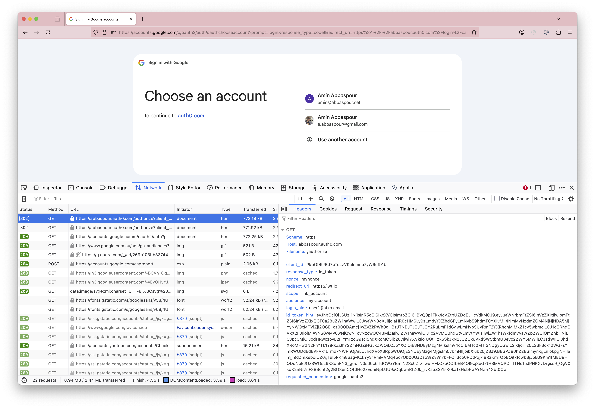

# client-initiated-account-linking
Client initiated Account Linking in Auth0

# Steps

## Linking

### Step 1) Authenticate user and obtain an id_token
Assuming you have a CLIENT_ID with implicit grant against callback URL https://jwt.io


```text
https://TENANT.auth0.com/authorize?client_id=CLIENT_ID &
    response_type=id_token &
    nonce=mynonce &
    redirect_uri=https://jwt.io &
    scope=openid profile email &
    max_age=300
```

### Step 2) Start a new transaction with link_account scope against my-account audience
Required arguments are:
* `audience`: `my-account`
* `scope`: `link_account`
* `requested_connection`: facebook, google-oauth2, etc 
* (optional) `requested_connection_scopes`: scopes to upstream IdP (TBA)



```text
https://TENANT.auth0.com/authorize?client_id=CLIENT_ID &
    response_type=id_token &
    nonce=mynonce &
    redirect_uri=https://jwt.io &
    scope=link_account &
    audience=my-account &
    id_token_hint=ID_TOKEN_STEP_1
    requested_connection=google-oauth2
```

### Step 3) Authenticate with upstream IdP 
After authentication user from step 1 should be linked to user from step 2. 


## Unlinking
### Step 1) Authenticate user and obtain an id_token
Same as step 1 from linking

### Step 2) Start a new transaction with unlink_account scope against my-account audience
Required arguments are:
* `audience`: `my-account`
* `scope`: `unlink_account`
* `requested_connection`: facebook, google-oauth2, etc


```text
https://TENANT.auth0.com/authorize?client_id=CLIENT_ID &
    response_type=id_token &
    nonce=mynonce &
    redirect_uri=https://jwt.io &
    scope=link_account &
    audience=my-account &
    id_token_hint=ID_TOKEN_STEP_1
    requested_connection=google-oauth2
```

### Step 3) Re-authenticate with primary connection
After authentication user from step 1 should be unlinked to user from step 2.

# Common issues
## sub mismatch
Current session user doesn't align with the id_token_hint supplied. 
Try logging out of the current session and login back again with the correct user.

## maxAge exceeded
id_token_hint or id_token from nested transaction are tool old. 
Try renewing the id_token by logging in interactively again.

## request_connection_scopes is not working
that functionality is wip.

